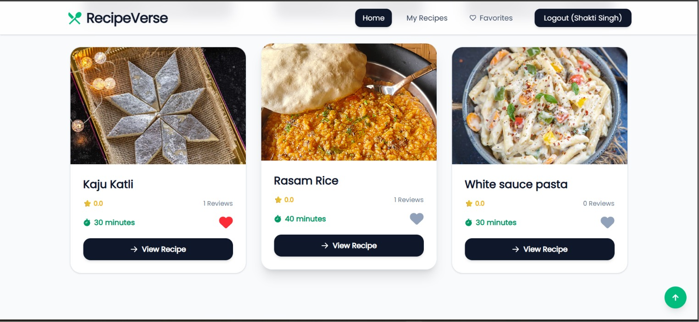
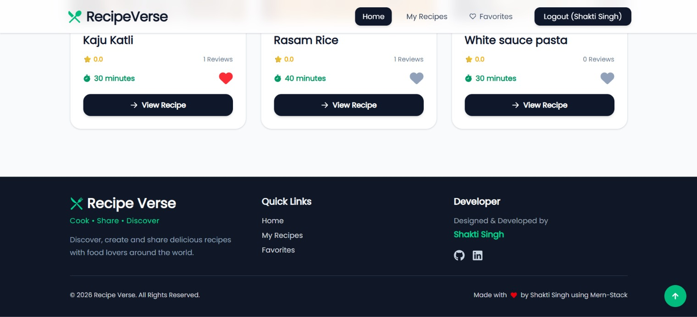
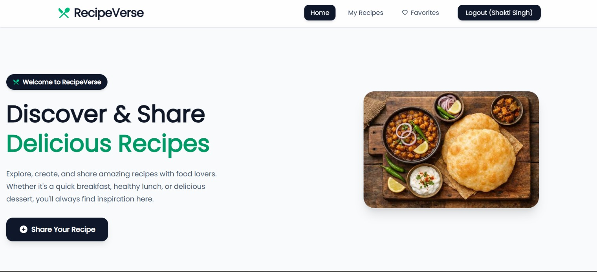
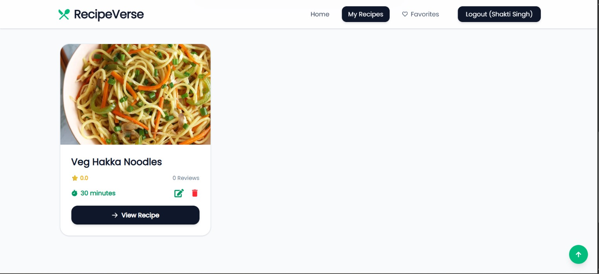
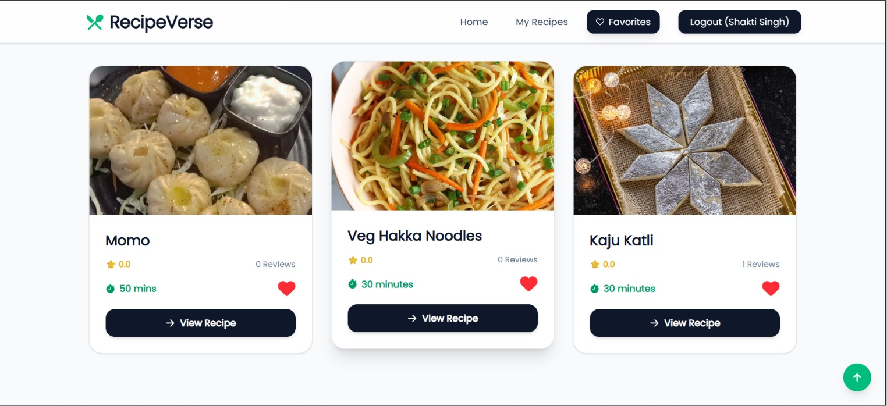
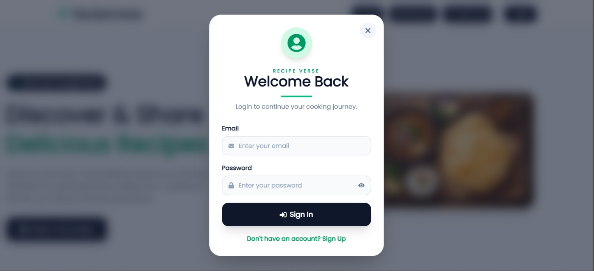
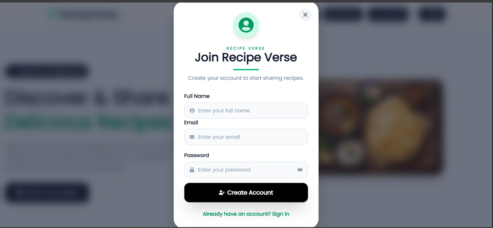
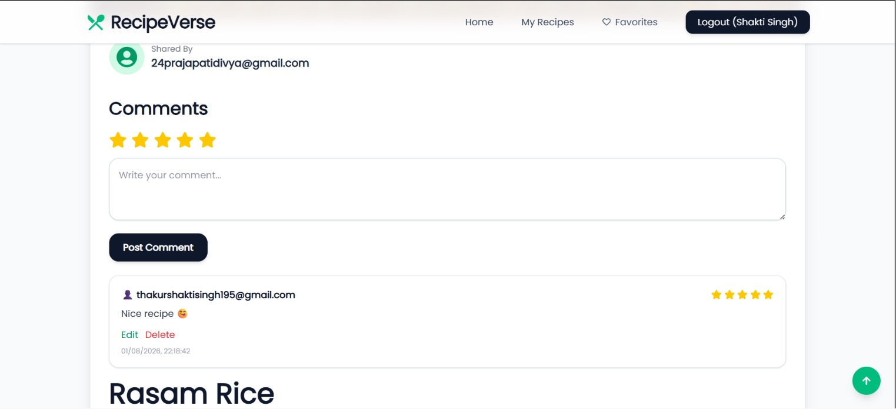
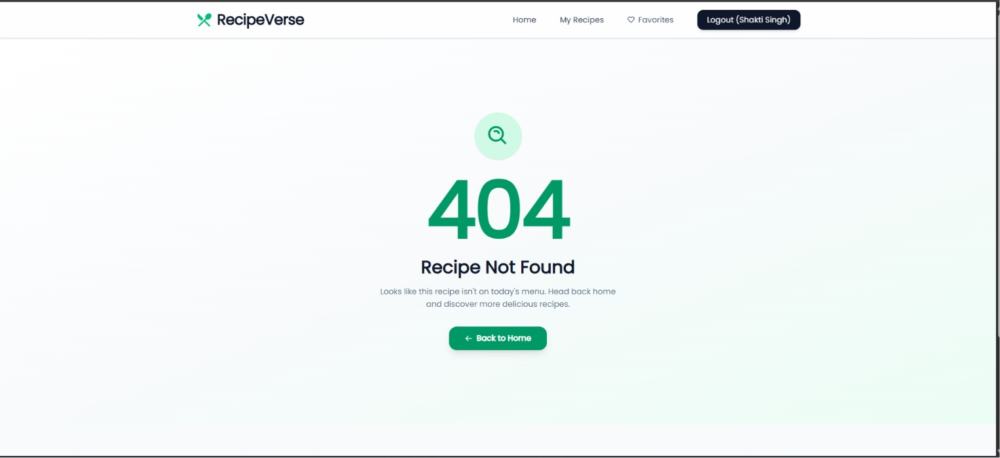

<div align="center">

# 🍽️ RecipeVerse

### A Modern Full-Stack Recipe Management Application built with the MERN Stack

Discover, create, review, and save your favourite recipes with a clean and responsive user experience.

<br>

[](https://react.dev/)
[](https://nodejs.org/)
[](https://www.mongodb.com/)
[](https://vitejs.dev/)
[]()

</div>

---

# 🌐 Live Demo

### 🚀 Frontend

https://food-recipe-planner.vercel.app/

### ⚙️ Backend API

https://food-recipe-planner.onrender.com/

---

# 📖 About

RecipeVerse is a full-stack recipe management web application that allows users to create, manage, and explore delicious recipes. Users can securely register, upload recipes with images, mark favourites, leave reviews, and manage their own collection through an intuitive and responsive interface.

---

# ✨ Features

## 🔐 Authentication

- User Registration
- Secure Login
- JWT Authentication
- Protected Routes
- Password Hashing using Bcrypt
- Logout

---

## 🍲 Recipe Management

- Create Recipes
- Edit Recipes
- Delete Recipes
- Upload Recipe Images
- View Recipe Details
- View My Recipes

---

## ❤️ Community Features

- Favourite Recipes
- Recipe Ratings
- Reviews & Comments
- Search Recipes

---

## 🎨 User Experience

- Responsive Design
- Modern UI
- Mobile Friendly
- Fast Loading with Vite
- Custom 404 Page

---

# 🛠 Tech Stack

| Frontend | Backend | Database | Deployment |
|----------|----------|-----------|------------|
| React.js | Node.js | MongoDB Atlas | Vercel |
| React Router | Express.js | Mongoose | Render |
| Axios | JWT | | |
| React Icons | Multer | | |
| CSS3 | Bcrypt | | |

---

# 📂 Folder Structure

```text
Food-Recipe-Planner
│
├── backend
│   ├── config
│   ├── controller
│   ├── middleware
│   ├── models
│   ├── routes
│   ├── public
│   ├── server.js
│   └── package.json
│
├── frontend
│   └── food-blog-app
│       ├── public
│       ├── src
│       │   ├── assets
│       │   ├── components
│       │   ├── Pages
│       │   ├── App.jsx
│       │   └── main.jsx
│       ├── vite.config.js
│       └── package.json
│
└── README.md
```

---

# 🚀 Getting Started

## Clone Repository

```bash
git clone https://github.com/Shakti-195/Food-Recipe-Planner.git
```

```bash
cd Food-Recipe-Planner
```

---

## Backend

```bash
cd backend
npm install
```

Create a `.env`

```env
PORT=5000
CONNECTION_STRING=YOUR_MONGODB_URI
SECRET_KEY=YOUR_SECRET_KEY
```

Run backend

```bash
npm start
```

---

## Frontend

```bash
cd frontend/food-blog-app

npm install

npm run dev
```

Frontend

```
http://localhost:5173
```

---

# 🔒 Authentication Flow

```text
User
   │
Signup / Login
   │
Password Encrypted (Bcrypt)
   │
JWT Generated
   │
Stored in Local Storage
   │
Protected API Routes
```

---

# 🌐 REST API

## Authentication

| Method | Endpoint |
|---------|----------|
| POST | /user/signup |
| POST | /user/login |
| GET | /user/:id |

---

## Favourites

| Method | Endpoint |
|---------|----------|
| GET | /user/favourites |
| POST | /user/favourites/:recipeId |
| DELETE | /user/favourites/:recipeId |

---

## Recipes

| Method | Endpoint |
|---------|----------|
| GET | /recipe |
| GET | /recipe/:id |
| POST | /recipe |
| PUT | /recipe/:id |
| DELETE | /recipe/:id |

---

# 📸 Screenshots

## 📸 Application Screenshots

<table>
<tr>
<td align="center">
<b>🏠 Home</b><br><br>

</td>

<td align="center">
<b>🔐 Login</b><br><br>

</td>
</tr>

<tr>
<td align="center">
<b>📝 Signup</b><br><br>

</td>

<td align="center">
<b>➕ Add Recipe</b><br><br>

</td>
</tr>

<tr>
<td align="center">
<b>🍲 Recipe Details</b><br><br>

</td>

<td align="center">
<b>❤️ Favourite Recipes</b><br><br>

</td>
</tr>

<tr>
<td align="center">
<b>👤 My Recipes</b><br><br>

</td>

<td align="center">
<b>📱 Mobile View</b><br><br>

</td>
</tr>

<tr>
<td colspan="2" align="center">
<b>🚫 Custom 404 Page</b><br><br>

</td>
</tr>
</table>
---

# 🚀 Roadmap

- 🌙 Dark Mode
- 🏷 Recipe Categories
- 👤 User Profile
- 📤 Share Recipes
- 🍽 Meal Planner
- 🤖 AI Recipe Suggestions
- 📊 Dashboard
- 🎮 Recipe Mini Game

---

# 🤝 Contributing

Contributions, issues and feature requests are welcome.

1. Fork the repository

2. Create your feature branch

```bash
git checkout -b feature-name
```

3. Commit changes

```bash
git commit -m "Add feature"
```

4. Push your branch

```bash
git push origin feature-name
```

5. Open a Pull Request

---

# 👨‍💻 Author

## Shakti Singh

**B.Tech Computer Science Engineering**

Full Stack Developer

📧 Feel free to connect.

- GitHub: https://github.com/Shakti-195
- LinkedIn: *(Add your LinkedIn Profile)*
- Portfolio: *(Add your Portfolio Link)*

---

# ⭐ Support

If you like this project, consider giving it a ⭐ on GitHub.

It motivates me to continue building open-source projects.

---

# 📄 License

This project is licensed under the MIT License.

---

<div align="center">

Made with ❤️ by **Shakti Singh**

</div>